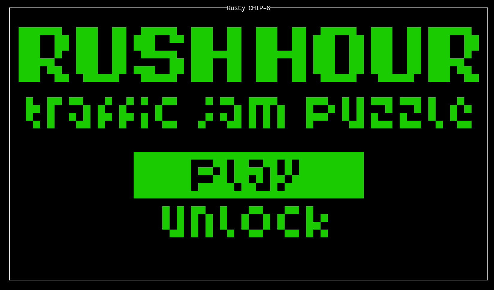
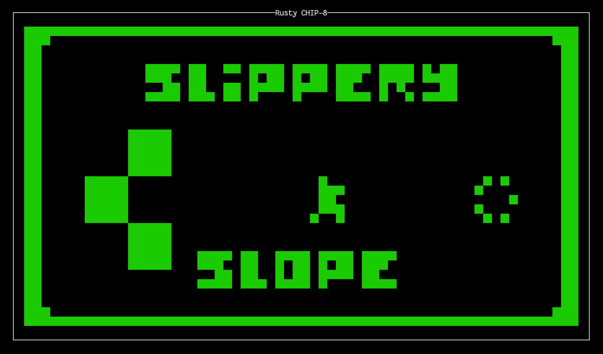
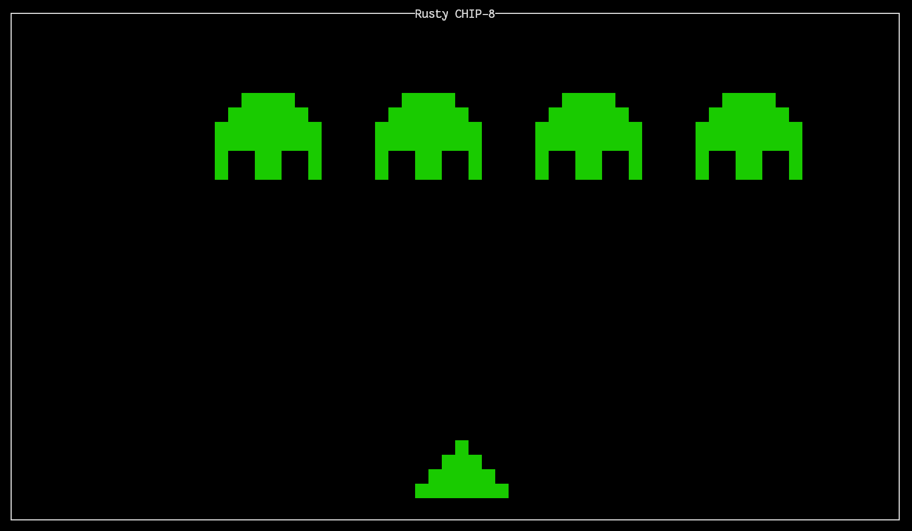

<!-- markdownlint-disable MD013 -->

# Rusty CHIP-8

A terminal-based (TUI) CHIP-8 emulator written in Rust using the [Ratatui](https://ratatui.rs) library

CHIP-8 is an interpreted programming language developed by Joseph Weisbecker in the mid 70s. The language uses hexadecimal codes for instructions, making it look similar to machine code. CHIP-8 interpreters have been developed for many devices such as computers, microcomputers, graphing calculators, mobile phones and video game consoles.

## Why this project?

The main motivation behind the project was to learn lower level programming concepts and to get more familiar with the Rust programming language.

Here are some concepts I learned while writing this program:

- How a CPU implements fetch, decode and execute
- How a CPU can utilize memory, stack, program counters, stack pointers, memory addresses, and registers
- How to disassemble and decode an opcode into instructions a CPU can use
- Becoming familiar with external Rust libraries, Rust's module system, error handling and test-driven development

## Screenshots


_Rush Hour_


_Slippery Slope_


_Space Invaders_

## Installation

You can run the emulator by using the precompiled binaries from the [releases page](https://git.py-cloud.net/Pyramidal/rusty-chip8/releases) or compile and install it from source using `cargo`

### Installation using `cargo`

First, install Rust and Cargo using the [rustup installer](https://rustup.rs):

```bash
curl --proto '=https' --tlsv1.2 -sSf https://sh.rustup.rs | sh
```

Cloning and installing

```bash
git clone https://git.py-cloud.net/Pyramidal/rusty-chip8.git
cd rusty-chip8
cargo install --path .
```

## Usage

```bash
rusty-chip8 <path-to-ROM>
```

## Keybindings

The CHIP-8 uses a 16-key hexadecimal keypad, mapped to the keyboard as follows:

|  CHIP-8 Keypad  |    Keyboard     |
| :-------------: | :-------------: |
| `1` `2` `3` `C` | `1` `2` `3` `4` |
| `4` `5` `6` `D` | `Q` `W` `E` `R` |
| `7` `8` `9` `E` | `A` `S` `D` `F` |
| `A` `0` `B` `F` | `Z` `X` `C` `V` |

## Limitations

Because of the way terminals handle input, some games where you need to press more than one key at once or where you need to hold a key (such as [Rush Hour](https://github.com/kripod/chip8-roms/blob/master/games/Rush%20Hour%20%5BHap%2C%202006%5D.ch8) or [Space Racer](https://johnearnest.github.io/chip8Archive/play.html?p=spaceracer)) may not work as intended on all terminals.

Rusty CHIP-8 automatically detects and uses the [Kitty keyboard protocol](https://sw.kovidgoyal.net/kitty/keyboard-protocol/) when your terminal supports it, which allows real simultaneous key presses and key holding to be detected correctly. This is currently supported by terminals such as **kitty**, **foot**, **WezTerm**, and **Alacritty**.

On terminals without this support (e.g. most default Linux terminal emulators, Windows Terminal, etc.), simultaneous key presses or key holding may not register as expected.

## Games

Looking for ROMs to try out? Here are some good places to find CHIP-8 games:

- [CHIP-8 Archive](https://johnearnest.github.io/chip8Archive/?sort=platform#chip8) — a curated collection of public-domain CHIP-8 programs
- [kripod/chip8-roms](https://github.com/kripod/chip8-roms/tree/master/games) — a GitHub repo with a large collection of classic CHIP-8 game ROMs
- [Pong-Story CHIP-8 page](https://www.pong-story.com/chip8/) — home of David Winter's original CHIP-8 emulator and games archive, with classics like PONG, BRIX, and INVADERS
